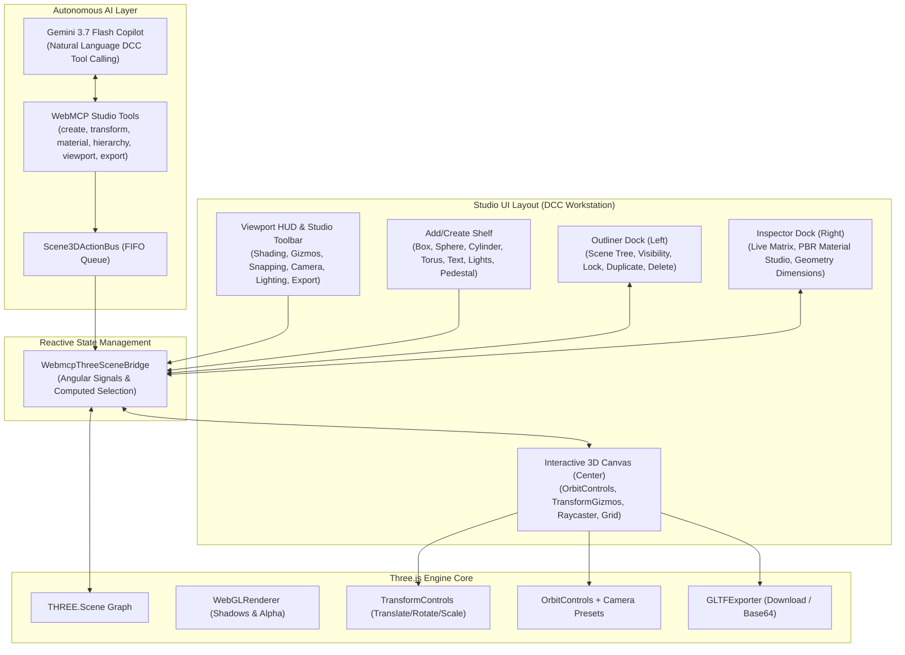

# SDD Design: 3D Creation Studio & WebMCP DCC Co-Pilot Architecture

**Change**: `3d-creation-studio`  
**Date**: 2026-08-27  
**Status**: Completed & Archived  

## 1. System Architecture

## 2. Technical Decisions & Tradeoffs

1. **TransformControls & OrbitControls Mediation**:
   - *Problem*: OrbitControls listening to mouse events while dragging TransformControls causes extreme camera shaking and disorientation.
   - *Solution*: Bind `dragging-changed` event on `TransformControls` to dynamically toggle `orbitControls.enabled = !event.value`.

2. **Angular Signals for Scene State**:
   - *Problem*: Frequent Three.js render loops (60fps) should not trigger excessive Angular change detection.
   - *Solution*: Bridge exposes standalone Angular signals (`selectedNode`, `sceneNodes`, `viewportConfig`, `sceneMetrics`) updated selectively on user interaction and tool actions.

3. **GPU Resource Disposal**:
   - *Problem*: Removing meshes dynamically during creation/deletion leads to WebGL memory leaks.
   - *Solution*: Recursive disposal helper disposing geometries, materials, and textures when deleting or resetting objects.

4. **SSR Safety**:
   - *Problem*: Angular Universal / SSR prerendering fails on direct window/WebGL access.
   - *Solution*: All Three.js canvas access, event listeners, and export triggers are gated behind `isPlatformBrowser(this.platformId)`.
