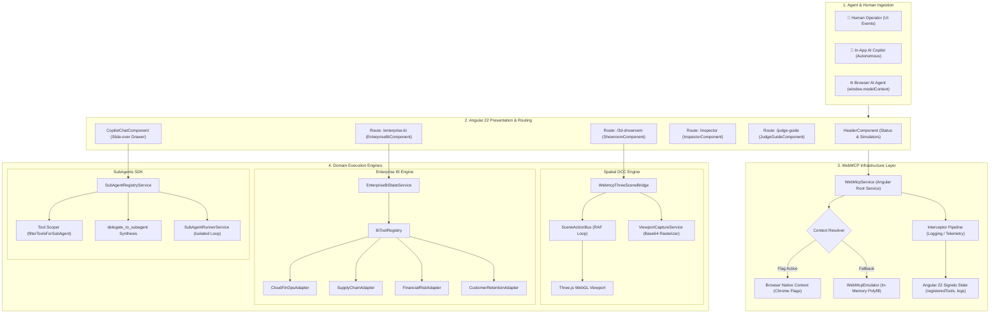
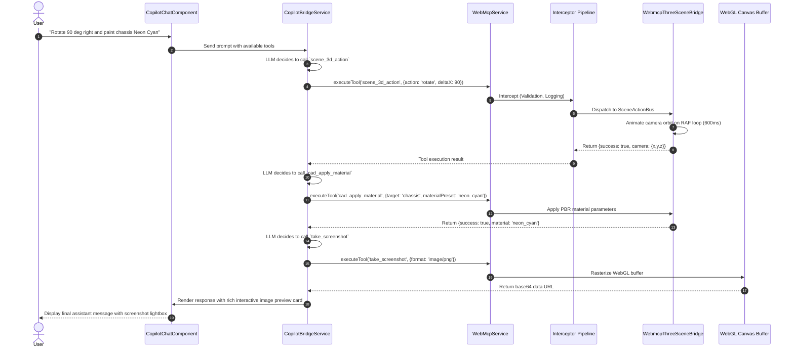
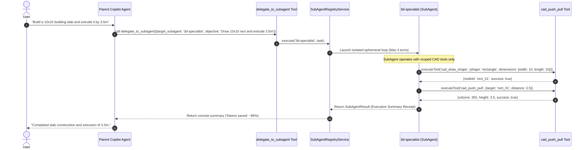

# WebMCP Angular Toolkit & 3D Enterprise Architecture 🏗️

This document outlines the end-to-end system architecture of the **WebMCP Angular Toolkit**, detailing the integration between **W3C WebMCP (Model Context Protocol in the Browser)**, Angular 22 Signals, Three.js WebGL Spatial Engine, Multi-Domain Enterprise Business Intelligence, and the Dynamic SubAgents Orchestration SDK.

---

## 🏛️ High-Level System Architecture

```
┌────────────────────────────────────────────────────────────────────────────────────────────────────────┐
│                                       HUMAN & AI AGENT INTERFACES                                      │
│  ┌────────────────────────┐  ┌─────────────────────────┐  ┌─────────────────────────────────────────┐  │
│  │   Interactive UI /     │  │   Built-in AI Copilot   │  │   External Browser AI Agent             │  │
│  │   Direct Manipulation  │  │   (Autonomous Multimodal)│  │   (Chrome Canary window.modelContext)   │  │
│  └───────────┬────────────┘  └────────────┬────────────┘  └────────────────────┬────────────────────┘  │
└──────────────┼────────────────────────────┼────────────────────────────────────┼───────────────────────┘
               │                            │                                    │
               ▼                            ▼                                    ▼
┌────────────────────────────────────────────────────────────────────────────────────────────────────────┐
│                                    ANGULAR 22 PRESENTATION LAYER                                       │
│  ┌───────────────────┐  ┌────────────────────┐  ┌────────────────────┐  ┌───────────────────────────┐  │
│  │ 3D Showroom View  │  │ Enterprise BI View │  │ WebMCP Inspector   │  │ Devpost Judge Guide       │  │
│  │ (/3d-showroom)    │  │ (/enterprise-bi)   │  │ (/inspector)       │  │ (/judge-guide)            │  │
│  └─────────┬─────────┘  └─────────┬──────────┘  └─────────┬──────────┘  └─────────────┬─────────────┘  │
│            │                      │                       │                           │                │
│            │  Angular Directives: [webmcpTool], [webmcpAction], toWebMcpTool()        │                │
└────────────┼──────────────────────┼───────────────────────┼───────────────────────────┼────────────────┘
             │                      │                       │                           │
             ▼                      ▼                       ▼                           ▼
┌────────────────────────────────────────────────────────────────────────────────────────────────────────┐
│                                  WEBMCP INFRASTRUCTURE LAYER                                           │
│  ┌──────────────────────────────────────────────────────────────────────────────────────────────────┐  │
│  │                                      WebMcpService                                               │  │
│  │  - Context Resolver: navigator.modelContext / window.modelContext || WebMcpEmulator              │  │
│  │  - Interceptor Pipeline: WEBMCP_INTERCEPTORS (Auth, Logging, Latency Metrics, Rate Limiting)     │  │
│  │  - Reactive Signals: registeredTools(), isNativeContext(), executionLogs(), isReady()            │  │
│  └────────────────────────────────────────────────┬─────────────────────────────────────────────────┘  │
└───────────────────────────────────────────────────┼────────────────────────────────────────────────────┘
                                                    │
                      ┌─────────────────────────────┼─────────────────────────────┐
                      ▼                             ▼                             ▼
┌──────────────────────────────────────┐ ┌──────────────────────────────┐ ┌──────────────────────────────┐
│     THREE.JS SPATIAL ENGINE          │ │     ENTERPRISE BI ENGINE     │ │      SUBAGENTS SDK           │
│  ┌────────────────────────────────┐  │ │ ┌──────────────────────────┐ │ │ ┌──────────────────────────┐ │
│  │ WebmcpThreeSceneBridge         │  │ │ │ EnterpriseBiStateService │ │ │ │ SubAgentRegistryService  │ │
│  │ - SceneActionBus (Frame-Sync)  │  │ │ │ - 4 Domain Adapters:     │ │ │ │ - Dynamic Tool Scoper    │ │
│  │ - CameraInterpolator (Lerp)    │  │ │ │   * CloudFinOpsAdapter   │ │ │ │ - createSubAgent Factory │ │
│  │ - 2D/3D CAD Drawing & Extrude  │  │ │ │   * SupplyChainAdapter   │ │ │ │ - createDelegationTool   │ │
│  │ - PBR Material Engine          │  │ │ │   * FinancialRiskAdapter │ │ │ │ - Ephemeral Multi-Turn   │ │
│  │ - ViewportCaptureService       │  │ │ │   * RetentionAdapter     │ │ │ │   Execution Loop         │ │
│  └────────────────────────────────┘  │ │ └──────────────────────────┘ │ │ └──────────────────────────┘ │
└──────────────────────────────────────┘ └──────────────────────────────┘ └──────────────────────────────┘
```

---

## 🔄 Mermaid Architecture Blueprint



---

## 🧱 Core Architectural Layers

### 1. Presentation Layer (Angular 22 Signals)
The presentation layer is built on **Angular 22 Standalone Components** utilizing **fine-grained Signals** (`signal()`, `computed()`, `effect()`) for state management with zero change-detection overhead.

- **Zoneless-Ready Reactivity**: UI components subscribe to Signals rather than dirty-checking trees, ensuring 60fps WebGL rendering and instant telemetry updates.
- **Route-Scoped Lifecycle**: Each workspace (`/3d-showroom`, `/enterprise-bi`, `/inspector`, `/judge-guide`) declares its tools upon initialization (`ngOnInit`) and unregisters them upon disposal (`ngOnDestroy`).
- **Declarative Template Directives**:
  - `[webmcpTool]`: Binds DOM elements or custom component handlers directly to the WebMCP registry.
  - `[webmcpAction]`: Exposes one-click simulation buttons that fire standardized WebMCP tool calls.
  - `toWebMcpTool()`: Converts any Angular `WritableSignal` into an agent-controllable tool.

### 2. WebMCP Infrastructure Layer
The bridge between the WebMCP standard and Angular's dependency injection container.

- **Hybrid Context Sensing**:
  ```typescript
  // Checks for native window.modelContext or navigator.modelContext
  const nativeContext = win?.modelContext || nav?.modelContext;
  if (nativeContext && typeof nativeContext.registerTool === 'function') {
    return nativeContext; // Chrome Canary with #enable-webmcp-testing
  }
  return new WebMcpEmulator(); // In-memory fallback
  ```
- **Interceptor Middleware Pipeline**:
  Supports composable middleware via the `WEBMCP_INTERCEPTORS` injection token or dynamic runtime registration (`webmcp.addInterceptor()`):
  ```typescript
  export interface WebMcpInterceptor {
    intercept(context: WebMcpExecutionContext, next: WebMcpHandler): Promise<unknown>;
  }
  ```
- **Execution Telemetry & Logging**:
  Captures caller source (`native`, `emulator`, `ui`), execution timestamps, millisecond duration latency, input arguments, and structured return values into an immutable reactive log signal.

### 3. Three.js WebGL Spatial Engine Bridge
Connects spatial 3D DCC (Digital Content Creation) operations with conversational agent reasoning.

- **Frame-Synchronized Action Bus (`SceneActionBus`)**:
  Prevents race conditions by scheduling camera lerps, material updates, and mesh transformations on the WebGL `requestAnimationFrame` loop with timeout protections.
- **Camera Interpolation Engine (`CameraInterpolator`)**:
  Calculates smooth spherical orbit transitions (look-at target vectors, field-of-view adjustments, and spherical angles).
- **SketchUp-Style Parametric CAD Pipeline**:
  - `cad_draw_shape`: Generates parametric 2D planar profiles (`rectangle`, `circle`, `line`, `wall`, `polygon`) on arbitrary 3D planes (`xz`, `xy`, `yz`, `ground`).
  - `cad_push_pull`: Extrudes planar profiles into 3D architectural solid volumes along normal vectors.
  - `cad_place_component`: Spawns pre-configured parametric architectural assets (`desk`, `chair`, `sofa`, `door`, `window`, `column`, `tree`, `car`).
  - `cad_apply_material`: Configures physical PBR materials (`concrete`, `wood_oak`, `brick_red`, `glass_frosted`, `marble_carrara`, `steel_brushed`, `gold`, `neon_cyan`).
  - `cad_measure`: Calculates 3D euclidean distances, bounding boxes, surface floor areas ($m^2$), volumes ($m^3$), and spatial clearances.
- **Client-Side Viewport Rasterizer (`WebMcpViewportCaptureService`)**:
  Reads the active WebGL buffer directly using `canvas.toDataURL('image/png')`, bypassing backend GPU rendering clusters and providing zero-latency visual feeds for multimodal vision models.

### 4. Multi-Domain Enterprise BI Engine
A reactive business intelligence platform driven by pluggable domain adapters and cryptographic audit trails.

- **Pluggable Domain Adapters (`BiDomainAdapter<TRecord, TFilter, TKpi>`)**:
  - `CloudFinOpsAdapter`: Cloud infrastructure unit economics, cost anomaly rates, MTTR impact, and budget variance.
  - `SupplyChainAdapter`: Inventory turnover rates, stockout risk indices, On-Time In-Full (OTIF) fulfillment, and warehouse valuations.
  - `FinancialRiskAdapter`: Fraud detection rate (FDR), AML transaction anomaly scoring, and portfolio risk distributions.
  - `CustomerRetentionAdapter`: Net Revenue Retention (NRR), churn hazard alerts, and customer health score aggregation.
- **Cryptographic Audit Exporting**:
  Every export generated via `trigger_analytics_export` produces an immutable SHA-256 integrity hash:
  $$\text{Checksum} = \text{SHA256}(\text{ExportPayload} + \text{Timestamp})$$

### 5. Dynamic SubAgents SDK (`@cobies/webmcp-angular`)
An Inversion-of-Control (IoC) subagent orchestration engine enabling parent agents to delegate subtasks to specialized worker profiles.

- **Multi-Strategy Tool Scoping**: Pure functional filtering supporting exact strings, regular expressions, custom predicate functions, and denylist precedence.
- **Reactive SubAgent Registry**: Exposes reactive Signals (`subagents()`, `activeTasks()`, `activeSubagents()`, `executionHistory()`) for real-time UI HUDs.
- **Dynamic Delegation Tool Synthesis**: Generates OpenAI-compatible function calling schemas with a live `enum` of available subagents and an up-to-date description of registered capabilities.
- **Context Window Token Optimization**: Subagents execute multi-turn loops in isolated ephemeral scopes, returning concise executive receipts (`SubAgentResult`) to prevent parent context bloat.

---

## ⚡ Synchronous & Reactive Data Flow

### 1. AI Copilot / Agent Tool Invocation Sequence



### 2. SubAgent Delegation Flow



---

## 🛡️ Security, Validation & Resilience Architecture

1. **Recursion Guard & Turn Caps**:
   - The Copilot multi-turn loop enforces a strict limit of 5 turns.
   - Ephemeral subagent loops enforce configurable limits (default: 4 turns).
2. **Context Token Sanitization**:
   - Base64 image strings (~500KB) from `take_screenshot` are sanitized from the textual LLM context window before subsequent turns, while preserving rich UI previews in the chat stream.
3. **Malformed JSON Self-Correction**:
   - Catches JSON syntax errors in LLM function arguments and supplies structured diagnostics back to the model for automated self-healing.
4. **Tainted Canvas Protection**:
   - Direct WebGL framebuffer extraction wraps context calls in security blocks to catch cross-origin asset contamination gracefully.
5. **Frame-Bus Timeout Watchdogs**:
   - All spatial animations executed on `SceneActionBus` include a hard timeout ($durationMs + 2000ms$) to guarantee that async promises always resolve.
