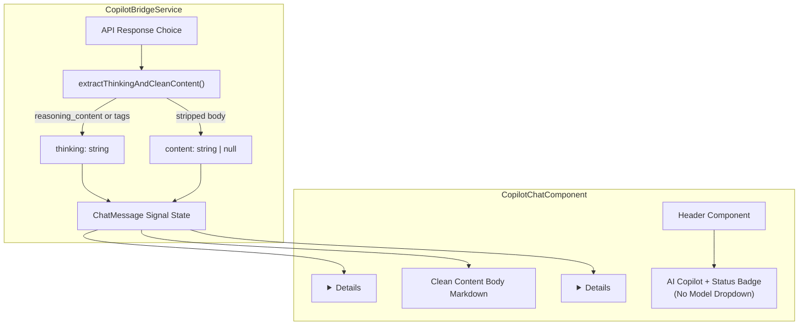

# Design: Hide AI Model Names & Accordions for Thinking / Tool Execution

**Change**: `hide-model-thinking-accordion`  
**Status**: Implemented & Verified  
**Target Environment**: Angular 22, Bun runtime, Tailwind CSS v4, `@webmcp/angular`  

---

## 1. Architectural Overview

---

## 2. Thinking Extraction & Tag Stripping Design

`extractThinkingAndCleanContent` in `CopilotBridgeService`:
1. Checks for direct properties `reasoning_content` and `reasoning` on the raw API message object.
2. Applies regex `/ <(?:think|thought)>([\s\S]*?)<\/(?:think|thought)>/gi` over `message.content` to collect embedded thinking blocks.
3. Strips all `<think>` / `<thought>` tags and trims leftover whitespace.
4. Returns `{ cleanContent: string | null, thinking?: string }`.

---

## 3. UI Component Structure & Styling

### 3.1 Model Branding Anonymization
- Replaced all static and dynamic references from vendor names to "AI Copilot".
- Generating indicator: `"Thinking & executing..."` instead of `"Gemini 3.7 Flash High reasoning..."`.
- Empty state banner and drawer header reflect `"AI Copilot"`.

### 3.2 Collapsible `
` Accordions
- **Thought Process Accordion**:
  - Border: `border-slate-200/80` with `bg-slate-50/50`.
  - Summary: `"💭 Thought Process"` with rotating SVG chevron (`group-open:rotate-180`).
  - Body: Scrollable font-mono block with `whitespace-pre-wrap text-[11px] text-slate-600`.
- **Tool Result Accordion**:
  - Encapsulates tool status badge, duration (`durationMs`), screenshot image preview modal trigger, and output payload.

---

## 4. Non-Destructive Model Switching
`CopilotBridgeService.selectedModel` remains a reactive Signal defaulted to `gemini-3.7-flash-high`. Programmatic consumers and test suites can modify it without requiring a UI dropdown.
