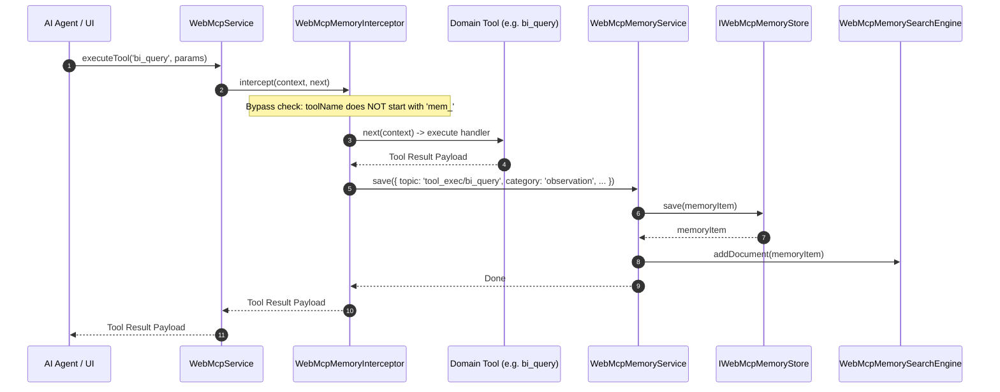
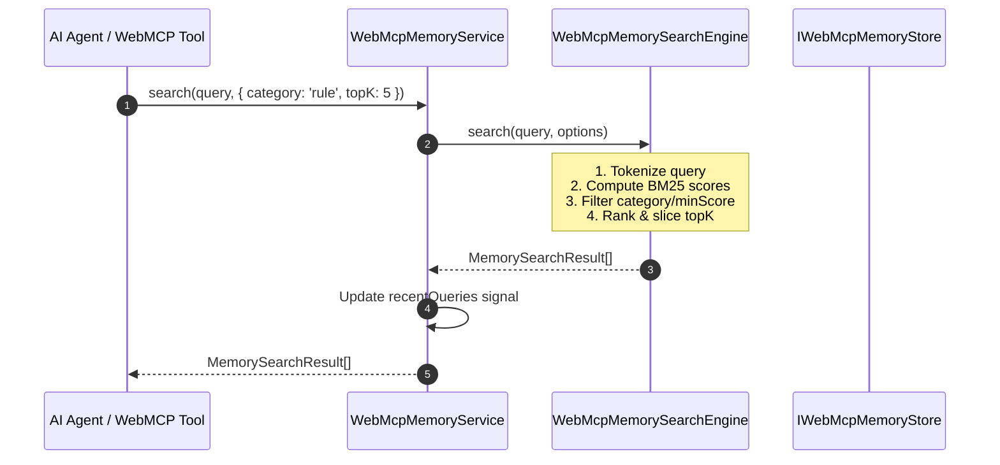

# Design: WebMCP In-Browser Memory System

## Technical Approach

The WebMCP In-Browser Memory System (`webmcp-in-browser-memory`) provides a zero-dependency, client-side episodic and semantic memory architecture for browser-based AI agents. It combines an asynchronous, transaction-safe storage engine abstraction (`IWebMcpMemoryStore` backed by `WebMcpIndexedDbStore` with automatic `WebMcpInMemoryStore` fallback for SSR/private browsing), a pure TypeScript BM25 lexical search engine (`WebMcpMemorySearchEngine`) with Robertson-Spärck Jones IDF ranking, standard WebMCP agent memory tools (`mem_save`, `mem_search`, `mem_context`, `mem_pin`, `mem_unpin`, `mem_session_summary`), a reactive Angular 22 Zoneless Signals service (`WebMcpMemoryService`), a passive tool interceptor (`WebMcpMemoryInterceptor`) with recursion guards, and an interactive Inspector UI.

```
+---------------------------------------------------------------------------------------+
|                                    Browser Runtime                                    |
|                                                                                       |
|  +---------------------------------------------------------------------------------+  |
|  |                             WebMCP Inspector UI                                 |  |
|  |   [Execution Logs]   |   [Memory Store & BM25 Playground]   |   [Memory Cards]      |  |
|  +-----------------------------------------+---------------------------------------+  |
|                                            | (Signals)                                |
|  +-----------------------------------------v---------------------------------------+  |
|  |                 WebMcpMemoryService (Angular 22 Signals Root)                   |  |
|  |   memories()  pinnedMemories()  stats()  recentQueries()  isReady()  computed()  |  |
|  +-------------------+---------------------+--------------------+------------------+  |
|                      |                     |                    |                     |
|  +-------------------v---+     +-----------v----------+     +---v------------------+  |
|  | WebMCP Memory Tools   |     | WebMcpMemorySearch   |     | Passive Interceptor  |  |
|  | mem_save, mem_search  |     | BM25 Lexical Engine  |     | & Router Listener    |  |
|  | mem_context, mem_pin  |     | TF-IDF / Tokenizer   |     | Anti-recursion Guard |  |
|  | mem_session_summary   |     | In-Memory Inv Index  |     | tool_exec & nav logs |  |
|  +-----------------------+     +----------------------+     +----------------------+  |
|                                            |                                          |
|  +-----------------------------------------v---------------------------------------+  |
|  |                     IWebMcpMemoryStore (Storage Abstraction)                    |  |
|  +--------------------+------------------------------------+-----------------------+  |
|                       |                                    |                          |
|         +-------------v-------------+        +-------------v-------------+            |
|         |   WebMcpIndexedDbStore    |        |    WebMcpInMemoryStore    |            |
|         |  (Browser IndexedDB API)  |        |  (SSR / Private Fallback) |            |
|         |  db: 'webmcp_memory_db'   |        |   Map<string, MemoryItem> |            |
|         +---------------------------+        +---------------------------+            |
+---------------------------------------------------------------------------------------+
```

---

## Architecture Decisions

### Decision 1: Storage Layer Abstraction with Automatic SSR/Private Mode Fallback

| Option | Tradeoffs | Decision |
|---|---|---|
| Direct IndexedDB without abstraction | Tight coupling; crashes during Angular SSR (`window` is undefined) and private browsing (`SecurityError`). | **Rejected** |
| LocalStorage wrapper | Synchronous 5MB limit; blocks main UI thread during large queries; lack of binary and compound indexing. | **Rejected** |
| Interface-driven dual store (`WebMcpIndexedDbStore` & `WebMcpInMemoryStore`) | Small initial abstraction overhead; guarantees zero runtime crashes across browser, SSR, Web Worker, and private modes. | **Accepted** |

**Rationale**: Angular 22 applications target hybrid rendering (client hydration + SSR). Providing a single unified `IWebMcpMemoryStore` interface backed by IndexedDB with seamless in-memory fallback guarantees robustness in every environment.

### Decision 2: Pure TypeScript BM25 Search vs Client ONNX Embedding Models

| Option | Tradeoffs | Decision |
|---|---|---|
| Client ONNX/Transformers.js embeddings | Heavy 30MB+ bundle size; slow initialization; WebGL/WASM memory pressure in constrained browser tabs. | **Rejected** |
| Simple substring / RegExp search | Poor relevance ranking; no term weighting (TF-IDF); zero fuzzy or multi-term relevance. | **Rejected** |
| Pure TypeScript BM25 Lexical Engine | Zero runtime dependencies; sub-millisecond query latency (<2ms for 10,000 items); deterministic ranking with field weighting. | **Accepted** |

**Rationale**: BM25 with Robertson-Spärck Jones IDF ranking provides industrial-grade relevance ranking for episodic memory without external dependencies or heavy neural network runtimes.

### Decision 3: Angular 22 Zoneless Signals State Architecture

| Option | Tradeoffs | Decision |
|---|---|---|
| RxJS Observables with `async` pipes | Requires subscription management, manual unsubscriptions, and legacy zone-based change detection assumptions. | **Rejected** |
| Plain mutable class properties | Requires manual `ChangeDetectorRef.markForCheck()` everywhere; prone to missed updates in zoneless mode. | **Rejected** |
| Native Angular Signals (`signal`, `computed`, `asReadonly`) | Native Zoneless change detection; fine-grained reactive graph; optimal rendering performance in Inspector UI. | **Accepted** |

**Rationale**: Angular 22 prioritizes Zoneless signal architectures. Exposing readonly signals from `WebMcpMemoryService` ensures clean reactive integration with templates and components.

### Decision 4: Passive Execution Interceptor with Anti-Recursion Loop Guard

| Option | Tradeoffs | Decision |
|---|---|---|
| Explicit tool-only capture | Agents must manually call `mem_save` after every action, creating boilerplate and cognitive burden. | **Rejected** |
| Global unrestricted interception | Causes infinite recursive loops when `mem_save` or `mem_search` execution triggers the interceptor itself. | **Rejected** |
| `WebMcpMemoryInterceptor` with `mem_*` prefix bypass | Automatic observation capture for all domain tools (`bi_*`, `dcc_*`, `rotate_camera`, etc.) while completely preventing recursion loops. | **Accepted** |

**Rationale**: Intercepting tool executions passively through `WEBMCP_INTERCEPTORS` creates a rich episodic log without cluttering agent prompts or causing execution loops.

---

## Component & Data Flow Architecture

### 1. Tool Execution & Passive Interception Sequence



### 2. Search & Context Retrieval Sequence



---

## Storage Engine Architecture

### Database Schema & Versioning
- **Database Name**: Configured via `WebMcpMemoryConfig.dbName` (Default: `'webmcp_memory_db'`).
- **Schema Version**: `1`.
- **Object Stores**:
  1. **`memories`** (Primary Store):
     - KeyPath: `id` (string UUID).
     - Indexes:
       - `by_topic`: `topic` (string, non-unique)
       - `by_category`: `category` (string, non-unique)
       - `by_pinned`: `pinned` (boolean/number, non-unique)
       - `by_updated`: `updatedAt` (number timestamp, non-unique)
       - `by_createdAt`: `createdAt` (number timestamp, non-unique)
       - `by_tags`: `tags` (string array, `multiEntry: true`)
  2. **`sessions`** (Session Summaries Store):
     - KeyPath: `sessionId` (string UUID).
     - Indexes:
       - `by_timestamp`: `timestamp` (number timestamp, non-unique)

### Transaction Safety & Promise Wrapper
- All storage operations wrap native `IDBRequest` / `IDBTransaction` inside Promise-based execution.
- Atomic read-write transactions (`db.transaction(['memories'], 'readwrite')`) handle `oncomplete`, `onerror`, `onabort`, and `onblocked` lifecycle events.
- Concurrency collisions during write operations resolve via transactional sequencing.

### SSR & Restricted Environment Detection
```typescript
export function isIndexedDbSupported(): boolean {
  try {
    if (typeof window === 'undefined' || typeof indexedDB === 'undefined') {
      return false;
    }
    // Test for private mode restrictions (e.g. Firefox private browsing throwing on open)
    return typeof indexedDB.open === 'function';
  } catch {
    return false;
  }
}
```
If `isIndexedDbSupported()` returns `false` or `indexedDB.open` throws a `SecurityError`, the store factory seamlessly instantiates `WebMcpInMemoryStore`, which maintains identical method signatures using in-memory `Map<string, MemoryItem>` structures.

---

## Lexical Search Engine Architecture & BM25 Algorithm

### BM25 Formulation
For a query $Q$ with terms $q_1, q_2, \dots, q_n$ and document $D$:
$$\text{Score}(D, Q) = \sum_{i=1}^n \text{IDF}(q_i) \cdot \frac{f(q_i, D) \cdot (k_1 + 1)}{f(q_i, D) + k_1 \cdot \left(1 - b + b \cdot \frac{|D|}{\text{avgdl}}\right)}$$

- **Hyperparameters**:
  - $k_1 = 1.2$ (term frequency saturation parameter).
  - $b = 0.75$ (document length normalization ratio).
- **Smoothed Robertson-Spärck Jones Inverse Document Frequency (IDF)**:
  $$\text{IDF}(q) = \ln\left(1 + \frac{N - n(q) + 0.5}{n(q) + 0.5}\right)$$
  where $N$ is total documents in corpus and $n(q)$ is number of documents containing term $q$.

### Multilingual Tokenization Pipeline
1. **Unicode NFKC Normalization & Lowercasing**: Normalizes composite glyphs and diacritics.
2. **Word Boundary Splitting**: `/[^\p{L}\p{N}]+/u` ensures non-Latin characters (Spanish accents, CJK, Cyrillic) are correctly segmented.
3. **Punctuation & Stopword Filtering**: Strips leading/trailing punctuation; discards common syntactic stopwords (`a`, `the`, `is`, `and`, `de`, `el`, `la`, `en`, `y`) and tokens with length $< 2$ (unless numeric).
4. **Field Weighting**:
   - `topic`: Term Frequency multiplier $2.0\times$
   - `tags`: Term Frequency multiplier $1.5\times$
   - `content`: Term Frequency multiplier $1.0\times$

### In-Memory Inverted Index Maintenance
```typescript
interface InvertedIndexEntry {
  // term -> Map of (documentId -> weighted term frequency)
  postings: Map<string, number>;
}
```
- Adding a document computes weighted term frequencies and increments document length counters in $O(T)$ time where $T$ is token count.
- Deleting or updating a document updates term postings and decrements $\text{avgdl}$ incrementally without full corpus re-indexing.

---

## WebMCP Memory Tools & Declarative Schemas

The memory module exports 6 standard declarative tool definitions:

| Tool Name | Parameters Schema Summary | Description |
|---|---|---|
| `mem_save` | `topic` (req), `content` (req), `category` (enum), `tags` (array), `pinned` (bool), `metadata` (object) | Persists an observation, fact, rule, context, preference, or session. |
| `mem_search` | `query` (req), `category` (enum/array), `top_k` (num), `min_score` (num), `pinned_only` (bool) | Searches persistent memories with BM25 relevance ranking and filters. |
| `mem_context` | `topic` (string), `limit` (number), `include_pinned_rules` (boolean) | Retrieves consolidated working context with formatted markdown output. |
| `mem_pin` | `id` (string), `topic` (string), `pinned` (boolean) | Pins a memory item to prevent eviction and surface in active context. |
| `mem_unpin` | `id` (string), `topic` (string) | Unpins a memory item. |
| `mem_session_summary` | `summary` (string), `topics` (array), `key_learnings` (array), `retrieve_recent` (number) | Records or retrieves structured session summaries and tool counts. |

---

## Angular 22 Signals State Management Architecture

`WebMcpMemoryService` is an `@Injectable({ providedIn: 'root' })` service providing fine-grained Signals:

```typescript
@Injectable({ providedIn: 'root' })
export class WebMcpMemoryService {
  // Primary State Signals
  private readonly _memories = signal<MemoryItem[]>([]);
  private readonly _isReady = signal<boolean>(false);
  private readonly _recentQueries = signal<Array<{ query: string; timestamp: number; resultCount: number }>>([]);
  private readonly _engineType = signal<'indexeddb' | 'in-memory'>('indexeddb');

  // Readonly Public Signals
  readonly memories = this._memories.asReadonly();
  readonly isReady = this._isReady.asReadonly();
  readonly recentQueries = this._recentQueries.asReadonly();

  // Computed Derived Signals
  readonly pinnedMemories = computed(() => this._memories().filter((m) => m.pinned));
  
  readonly stats = computed<MemoryStats>(() => {
    const items = this._memories();
    const categoryCounts: Record<MemoryCategory, number> = {
      observation: 0,
      fact: 0,
      rule: 0,
      context: 0,
      preference: 0,
      session: 0,
    };
    let estimatedBytes = 0;

    for (const item of items) {
      categoryCounts[item.category] = (categoryCounts[item.category] || 0) + 1;
      estimatedBytes += item.topic.length * 2 + item.content.length * 2 + 128;
    }

    return {
      totalCount: items.length,
      pinnedCount: items.filter((m) => m.pinned).length,
      categoryCounts,
      estimatedStorageBytes: estimatedBytes,
      engineType: this._engineType(),
    };
  });
}
```

---

## Passive Interceptor & Navigation Pipeline

### 1. `WebMcpMemoryInterceptor`
- Implements `WebMcpInterceptor`.
- Anti-Recursion Guard: Immediately calls `next(context)` without saving if `context.toolName.startsWith('mem_')`.
- Safe Execution Wrapper:
  ```typescript
  export class WebMcpMemoryInterceptor implements WebMcpInterceptor {
    constructor(
      private memoryService: WebMcpMemoryService,
      @Optional() @Inject(WEBMCP_MEMORY_CONFIG) private config?: WebMcpMemoryConfig
    ) {}

    async intercept(context: WebMcpExecutionContext, next: WebMcpHandler): Promise<unknown> {
      if (context.toolName.startsWith('mem_') || this.config?.enablePassiveToolCapture === false) {
        return next(context);
      }

      try {
        const result = await next(context);
        this.captureExecution(context, result, undefined);
        return result;
      } catch (error) {
        this.captureExecution(context, undefined, error);
        throw error;
      }
    }

    private captureExecution(context: WebMcpExecutionContext, result: unknown, error: unknown): void {
      const isError = !!error;
      this.memoryService.save({
        topic: `tool_exec/${context.toolName}`,
        category: 'observation',
        content: isError
          ? `Tool execution '${context.toolName}' failed: ${error instanceof Error ? error.message : String(error)}`
          : `Tool execution '${context.toolName}' completed successfully.`,
        tags: ['passive', 'tool-execution', context.toolName, isError ? 'status:error' : 'status:success'],
        metadata: {
          parameters: context.parameters,
          status: isError ? 'error' : 'success',
          source: context.source
        }
      }).catch(() => { /* silent fail for passive background tasks */ });
    }
  }
  ```

### 2. Router Navigation Listener
- Subscribes to Angular `Router` events (`NavigationEnd`).
- When `enableNavigationCapture: true` (default), persists a `'context'` memory with topic `navigation/route_change` and URL parameters.

---

## Memory Inspector UI Architecture

The WebMCP Inspector (`src/app/components/inspector/inspector.component.ts`) is updated with a dual-tab header:
1. **Tool Execution Logs** (Tab 1)
2. **Memory Store** (Tab 2)

### Memory Tab Sub-Views & Structure
- **Storage Metrics Bar**: Display cards for Total Memories, Pinned Items, Storage Engine badge (`IndexedDB` / `In-Memory`), and Estimated Size (KB).
- **Interactive Query Playground**:
  - Search input with real-time BM25 evaluation.
  - Category selector pills (`all`, `observation`, `fact`, `rule`, `context`, `preference`, `session`).
  - "Pinned Only" filter toggle.
- **Memory Card List**:
  - Category indicator badge with color coding (Purple: `rule`, Cyan: `fact`, Emerald: `observation`, Amber: `preference`, Blue: `context`, Slate: `session`).
  - Topic header, timestamp, and BM25 match score chip (when searching).
  - Markdown/plain text preview.
  - Actions: Pin/Unpin button (`📌`), Delete button (`🗑️`).
- **Memory Debug Composer**: Collapsible drawer to manually inject memories into the active store.

---

## File Changes & Structure Breakdown

| File | Action | Description |
|---|---|---|
| `src/lib/memory/memory.types.ts` | Create | Domain models, category enums, query options, search results, and config types |
| `src/lib/memory/memory-store.interface.ts` | Create | `IWebMcpMemoryStore` storage abstraction interface |
| `src/lib/memory/indexeddb-store.ts` | Create | IndexedDB implementation with transaction safety, compound indexes, and lifecycle hooks |
| `src/lib/memory/in-memory-store.ts` | Create | In-memory `Map`-based fallback store for SSR and restricted private browsing |
| `src/lib/memory/search-engine.ts` | Create | Pure TypeScript BM25 search engine with Robertson-Spärck Jones IDF & multilingual tokenizer |
| `src/lib/memory/memory-tools.ts` | Create | WebMCP tool definitions (`mem_save`, `mem_search`, `mem_context`, `mem_pin`, `mem_unpin`, `mem_session_summary`) |
| `src/lib/memory/memory-interceptor.ts` | Create | `WebMcpMemoryInterceptor` integrating with `WEBMCP_INTERCEPTORS` with anti-recursion guard |
| `src/lib/memory/navigation-listener.ts` | Create | Angular Router event listener recording route changes into memory |
| `src/lib/memory/memory.service.ts` | Create | Root Angular 22 Signals service managing store, search, and reactive state |
| `src/lib/memory/memory.provider.ts` | Create | `provideWebMcpMemory()` provider factory with `ENVIRONMENT_INITIALIZER` |
| `src/lib/memory/index.ts` | Create | Module barrel export |
| `src/lib/public-api.ts` | Modify | Export memory types, service, interceptor, and provider |
| `src/app/components/inspector/inspector.component.ts` | Modify | Add Memory Store tab, BM25 query playground, metrics bar, and memory cards |
| `src/app/app.config.ts` | Modify | Register `provideWebMcpMemory()` in application providers |

---

## Interfaces / Contracts

```typescript
// src/lib/memory/memory.types.ts

export type MemoryCategory =
  | 'observation'
  | 'fact'
  | 'rule'
  | 'context'
  | 'preference'
  | 'session';

export interface MemoryItem {
  id: string;
  topic: string;
  content: string;
  category: MemoryCategory;
  tags: string[];
  pinned: boolean;
  createdAt: number;
  updatedAt: number;
  lastAccessedAt: number;
  accessCount: number;
  metadata?: Record<string, unknown>;
}

export interface MemoryQuery {
  query: string;
  category?: MemoryCategory | MemoryCategory[];
  tags?: string[];
  pinnedOnly?: boolean;
  topK?: number;
  minScore?: number;
  dateRange?: { start?: number; end?: number };
}

export interface MemorySearchResult {
  item: MemoryItem;
  score: number;
  matchedTerms: string[];
}

export interface MemoryStats {
  totalCount: number;
  pinnedCount: number;
  categoryCounts: Record<MemoryCategory, number>;
  estimatedStorageBytes: number;
  engineType: 'indexeddb' | 'in-memory';
}

export interface MemorySessionSummary {
  sessionId: string;
  sessionName?: string;
  timestamp: number;
  summary: string;
  topicsCovered: string[];
  keyLearnings: string[];
  toolsUsedCount: Record<string, number>;
  metadata?: Record<string, unknown>;
}

export interface WebMcpMemoryConfig {
  dbName?: string;
  dbVersion?: number;
  bm25_k1?: number;
  bm25_b?: number;
  enablePassiveToolCapture?: boolean;
  enableNavigationCapture?: boolean;
  maxMemories?: number;
  autoRegisterTools?: boolean;
}
```

---

## Testing Strategy

| Layer | What to Test | Approach |
|---|---|---|
| **Unit** (`search-engine.spec.ts`) | BM25 tokenization, term frequency weighting (topic $2\times$, tags $1.5\times$), Robertson-Spärck Jones IDF scoring, stopword pruning, incremental index mutation. | Bun test suite with synthetic corpora and relevance threshold assertions. |
| **Unit** (`indexeddb-store.spec.ts`) | IndexedDB store initialization, CRUD operations, compound index queries, atomic transactions, error handling, in-memory store fallback. | FakeIndexedDB / mock IndexedDB environment testing across normal, private, and SSR modes. |
| **Unit** (`memory.service.spec.ts`) | Signals reactivity (`memories`, `pinnedMemories`, `stats`), context formatting, pin/unpin toggles, tool registrations in `WebMcpService`. | Angular TestBed with Zoneless signals verification. |
| **Integration** (`memory-interceptor.spec.ts`) | Tool execution capture, `mem_*` anti-recursion bypass, error logging, and router navigation capture. | Spy on `WebMcpService.executeTool` and verify memory records generated passively. |
| **Integration** (`inspector.component.spec.ts`) | Inspector tab switching, live BM25 search filtering, memory card pin toggles, delete action, storage metric badges. | Component harness rendering and DOM interaction testing. |

---

## Threat Matrix

| Boundary | Minimum adversarial cases | Applicability | Design response | Planned RED tests |
|---|---|---|---|---|
| Navigation & Route Tracking | Malformed URLs, XSS payloads in query parameters, rapid route flapping | Applicable | Sanitization of route URLs before storing in context memory; truncation of oversized query string payloads. | Test `WebMcpNavigationListener` with malicious URL parameters and rapid navigation bursts. |
| Memory Content Injection | Script tags (`<script>`), prompt injections, oversized base64 strings in memory items | Applicable | Markdown escape sanitization in Inspector UI; size limits (max 64KB per content payload); metadata stringification guards. | Test `safeJsonStringify` and memory card rendering against `<script>` tags and 1MB payloads. |
| Storage Quota & Exhaustion | Malicious loop generating 100,000 memories to fill browser storage | Applicable | Configurable `maxMemories` (default 10,000) with LRU eviction of unpinned ephemeral memories. | Test store eviction logic when saving past `maxMemories` boundary. |
| Subprocesses / Shell | N/A | N/A | Browser-only client execution; no shell or child process boundary. | None |
| Git / PR Automation | N/A | N/A | Client-side memory subsystem; no VCS execution boundary. | None |

---

## Migration / Rollout

No database migration is required since `webmcp_memory_db` is a new client-side store created on first application initialization. 

- **Rollout**: Included in `@cobies/webmcp-angular` root exports and activated in `app.config.ts` via `provideWebMcpMemory()`.
- **Rollback**: Remove `provideWebMcpMemory()` from `app.config.ts`; core WebMCP functionality and Inspector tool logs operate independently without errors.

---

## Open Questions

- None. All architectural interfaces, storage fallbacks, BM25 scoring algorithms, signal patterns, and UI components are fully defined and aligned with the specification.
