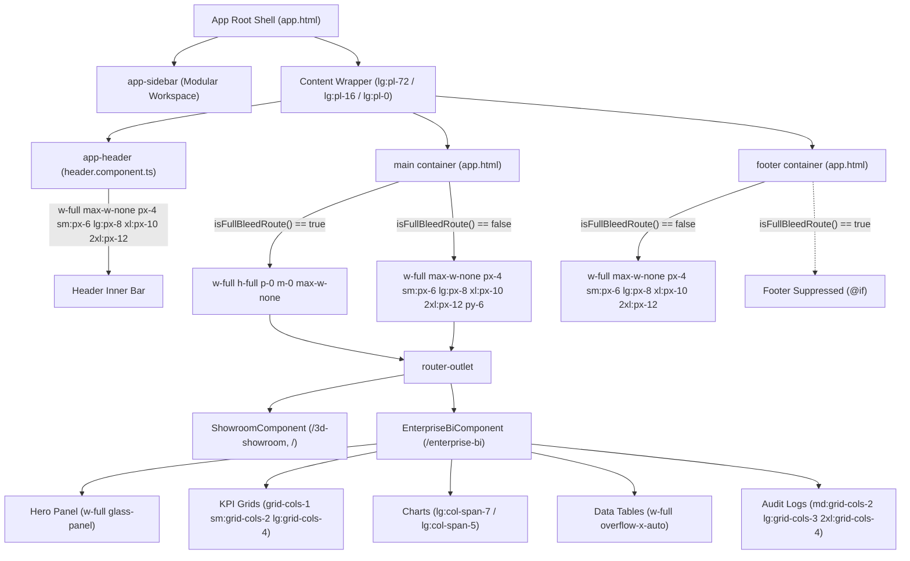

# Design: Enterprise BI Fluid Full-Width Layout & High-Density Display Optimization

## Technical Approach

Transition the application shell, navigation header, global footer, and Enterprise BI dashboard from fixed-width bounding boxes (`max-w-7xl` / 1280px) to a responsive, fluid edge-to-edge layout (`w-full max-w-none px-4 sm:px-6 lg:px-8 xl:px-10 2xl:px-12`). Route-aware computed signals (`isFullBleedRoute()`) dynamically branch between zero-margin/zero-padding 3D CAD full-bleed mode and fluid dashboard mode with progressive horizontal gutters for 1080p, 1440p, 4K, and ultra-wide displays.

## Architecture Decisions

| Decision | Option Chosen | Alternatives Considered | Tradeoff & Rationale |
|---|---|---|---|
| **Shell Bounding Model** | Progressive responsive gutters (`px-4` to `2xl:px-12`) | Fixed `max-w-7xl` (1280px) or `max-w-screen-2xl` (1536px) | Eliminates horizontal dead space on wide monitors while preserving readability without extreme outer-edge collision. |
| **CAD / 3D Showroom Routing** | Route-driven signal branching via `isFullBleedRoute()` | Route-specific wrapper components or global body CSS overrides | Preserves strict separation of zero-margin WebGL canvas viewports without leaking styles into standard views. |
| **Grid Density Scaling** | Adaptive multi-column scaling (`2xl:grid-cols-4`) | Fixed 3-column grids or auto-fit CSS columns | Maximizes screen real estate on high-density displays (≥1536px) while preventing squished cards on standard laptops. |
| **Vector Chart Elasticity** | SVG vector charts with `preserveAspectRatio="none"` | Static pixel widths or canvas redraw observers | Provides smooth, zero-recalculation vector expansion across arbitrary viewport widths without layout shifts. |

## Component & Layout Hierarchy



## Data Flow

```
Router Navigation (NavigationEnd)
       │
       ▼
App.currentUrl (signal) ──→ isFullBleedRoute (computed)
                                  │
         ┌────────────────────────┴────────────────────────┐
         ▼ (true)                                          ▼ (false)
  CAD Showroom Shell:                               Standard Dashboard Shell:
  - <main>: p-0 m-0 max-w-none                     - <main>: w-full max-w-none px-4..2xl:px-12
  - <footer>: Suppressed                           - <footer>: Rendered with fluid padding
  - Canvas: 100% WebGL Viewport                    - View: EnterpriseBiComponent (100% width)
```

## File Changes

| File | Action | Description |
|---|---|---|
| `src/app/app.html` | Modify | Replace `max-w-7xl` in `<main>` and `<footer>` with `w-full max-w-none px-4 sm:px-6 lg:px-8 xl:px-10 2xl:px-12`. |
| `src/app/components/header/header.component.ts` | Modify | Update top bar inner container to `w-full max-w-none px-4 sm:px-6 lg:px-8 xl:px-10 2xl:px-12`. |
| `src/app/components/enterprise-bi/enterprise-bi.component.ts` | Modify | Add `w-full` to root container and upgrade audit log grids to `2xl:grid-cols-4`. |
| `src/app/app.spec.ts` | Modify | Add unit assertions validating fluid layout class string contract and full-bleed isolation. |

## Interfaces / Contracts

### Fluid Container Class String Standard
```typescript
export const FLUID_CONTAINER_CLASSES =
  'w-full max-w-none px-4 sm:px-6 lg:px-8 xl:px-10 2xl:px-12';

export const FULL_BLEED_MAIN_CLASSES =
  'flex-1 w-full h-full p-0 m-0 max-w-none flex flex-col min-h-0 overflow-hidden';

export const FLUID_DASHBOARD_MAIN_CLASSES =
  'flex-1 w-full max-w-none px-4 sm:px-6 lg:px-8 xl:px-10 2xl:px-12 py-6 overflow-y-auto';
```

## Testing Strategy

| Layer | What to Test | Approach |
|---|---|---|
| Unit | Route layout detection & class contracts | In `src/app/app.spec.ts`, verify `isFullBleedRoute()` output and test expected shell class strings for both route types. |
| Unit | Enterprise BI tool registration & signals | In `src/app/components/enterprise-bi/enterprise-bi.component.spec.ts`, ensure all 9 WebMCP tools and signals operate normally with fluid layouts. |
| Integration | Mobile drawer & layout responsiveness | Validate sidebar toggle and no horizontal layout overflow across `< 640px`, `1024px`, `1920px`, and `2560px`. |

## Threat Matrix

`N/A — no routing, shell, subprocess, VCS/PR automation, executable-file classification, or process-integration boundary.`

## Migration / Rollout

No migration required. Layout changes are applied entirely via Tailwind CSS utility classes and Angular template bindings with zero breaking API changes.

## Open Questions

None.
