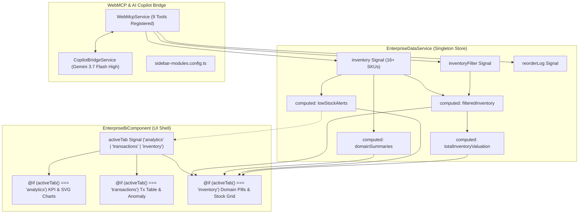
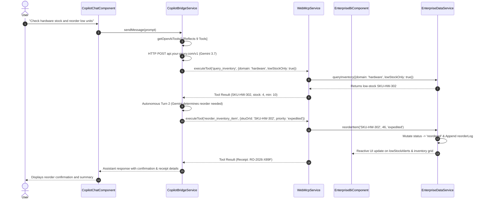

# Design: Enterprise BI Multi-Domain & Inventory Sub-Navigation

**Change**: `enterprise-bi-inventory-nav`  
**Status**: Ready for Tasks  
**Target Platform**: Angular 22, Bun Runtime, Tailwind CSS v4, WebMCP Standard, Gemini 3.7 Flash High  

---

## 1. Technical Approach

The `enterprise-bi-inventory-nav` change expands the standalone `EnterpriseBiComponent` from a single-view telemetry screen into a multi-domain enterprise workspace. It introduces:
1. **Multi-Domain Inventory State**: Deterministic catalog of 16+ SKUs across 4 domains (`retail`, `hardware`, `logistics`, `pharma`) in `EnterpriseDataService` using Angular Signals (`inventory`, `inventoryFilter`, `reorderLog`).
2. **Computed Aggregations**: Derived signals (`filteredInventory`, `domainSummaries`, `totalInventoryValuation`, `lowStockAlerts`) providing zero-latency reactive evaluations.
3. **Internal Sub-Navigation**: Reactive 3-tab layout (`Analytics & Telemetry`, `Transactions`, `Multi-Domain Inventory`) driven by an `activeTab = signal<EnterpriseBiTab>('analytics')` state.
4. **9 WebMCP Tools Suite**: Seamless registration of 5 inventory tools (`query_inventory`, `update_inventory_stock`, `reorder_inventory_item`, `filter_inventory_by_domain`, `get_business_domain_summary`) alongside 4 existing BI tools during component lifecycle (`ngOnInit` / `ngOnDestroy`).
5. **Copilot Bridge & Sidebar Integration**: Automated OpenAI function schema generation in `CopilotBridgeService` and updated tool inventory in `sidebar-modules.config.ts`.

---

## 2. Architecture Decisions

| Decision | Choice | Alternatives Considered | Rationale |
|---|---|---|---|
| **Sub-Navigation Strategy** | Internal Component Signal (`activeTab`) | Separate Angular Child Routes (`/bi/analytics`, `/bi/inventory`) | Retains single-page performance, preserves WebMCP tool registration lifecycle without remounting overhead, and avoids router thrashing. |
| **Inventory State Management** | Centralized Signals in `EnterpriseDataService` | Local component signals or external NgRx Store | Guarantees single source of truth accessible across sub-tabs, AI tool handlers, and test fixtures without RxJS boilerplate. |
| **Stock Status Transitions** | Deterministic threshold logic inside service mutations | Manual client status tagging | Guarantees consistent state transitions (`in_stock` ↔ `low_stock` ↔ `out_of_stock` ↔ `reordered`) upon stock adjustments and reorder events. |
| **Domain Aggregations** | Fine-grained `computed()` signal map | On-demand array reduction per view render | Eliminates redundant calculations, updates reactively only when `inventory` mutations occur. |
| **Tool Availability Scope** | All 9 enterprise tools registered concurrently | Lazy registering tools per active sub-tab | AI Copilot can autonomously query or mutate inventory while the user views telemetry, providing seamless multi-turn assistance. |

---

## 3. Data Flow & Signal Architecture



### 3.1 Autonomous AI Copilot WebMCP Sequence Flow



---

## 4. Component & Navigation Design

### 4.1 `EnterpriseBiComponent` Internal Navigation
- State: `activeTab = signal<EnterpriseBiTab>('analytics')`.
- Tab Header contains 3 toggle buttons with active pill styling (`bg-cyan-100 text-cyan-800 border-cyan-300`).
- Inventory tab displays dynamic badge: `{{ dataService.lowStockAlerts().length }}`.
- Sub-tab views use Angular `@if (activeTab() === ...)` blocks to maintain clean layout rendering.

### 4.2 WebMCP 9 Tools Registration Table

| # | Tool Name | Scope | Handler Action |
|---|---|---|---|
| 1 | `query_enterprise_metrics` | Telemetry | Calls `dataService.queryMetrics()` |
| 2 | `filter_business_data` | Transactions | Calls `dataService.filterTransactions()` |
| 3 | `calculate_kpi_summary` | Telemetry | Calls `dataService.calculateKpiSummary()` |
| 4 | `trigger_analytics_export` | Audit | Calls `dataService.triggerExport()` |
| 5 | `query_inventory` | Inventory | Calls `dataService.queryInventory()` |
| 6 | `update_inventory_stock` | Inventory | Calls `dataService.updateStockLevel()` |
| 7 | `reorder_inventory_item` | Inventory | Calls `dataService.reorderItem()` |
| 8 | `filter_inventory_by_domain` | Inventory | Sets `activeTab('inventory')` & calls `dataService.updateInventoryFilter()` |
| 9 | `get_business_domain_summary` | Cross-Domain | Calls `dataService.getDomainSummary()` |

---

## 5. File Changes

| File | Action | Description |
|---|---|---|
| `src/app/models/enterprise-bi.types.ts` | **Modify** | Add `BusinessDomain`, `InventoryStockStatus`, `EnterpriseBiTab`, `ReorderPriority`, `InventoryItem`, `InventorySupplier`, `InventoryFilterState`, `DomainSummaryResult`, `ReorderReceipt`. |
| `src/app/services/enterprise-data.service.ts` | **Modify** | Add initial 16-item inventory catalog across 4 domains, `inventoryFilter`, `reorderLog` signals, computed signals (`filteredInventory`, `domainSummaries`, `totalInventoryValuation`, `lowStockAlerts`), and operational mutation methods. |
| `src/app/components/enterprise-bi/enterprise-bi.component.ts` | **Modify** | Add `activeTab` signal, 3-tab navigation bar, inventory panel with domain filter pills, stock metric cards, interactive data table with quick reorder action, and register all 9 WebMCP tools. |
| `src/app/config/sidebar-modules.config.ts` | **Modify** | Update `view-enterprise-bi` entry tools array to include all 9 tools. |
| `src/app/components/enterprise-bi/enterprise-bi.component.spec.ts` | **Modify** | Update unit test suites to verify 9 tools lifecycle, sub-tab switching, inventory queries, stock mutations, reorder dispatches, and domain aggregations. |

---

## 6. Interfaces & Data Contracts

```typescript
export type BusinessDomain = 'retail' | 'hardware' | 'logistics' | 'pharma' | 'all';
export type InventoryStockStatus = 'in_stock' | 'low_stock' | 'out_of_stock' | 'reordered';
export type EnterpriseBiTab = 'analytics' | 'transactions' | 'inventory';
export type ReorderPriority = 'standard' | 'expedited' | 'critical';

export interface InventorySupplier {
  id: string;
  name: string;
  leadTimeDays: number;
  rating: number;
  contactEmail: string;
}

export interface InventoryItem {
  id: string;
  sku: string;
  name: string;
  domain: BusinessDomain;
  stockLevel: number;
  minThreshold: number;
  maxCapacity: number;
  unitPrice: number;
  currency: string;
  status: InventoryStockStatus;
  supplier: InventorySupplier;
  lastRestocked: string;
  location: string;
}

export interface InventoryFilterState {
  domain: BusinessDomain;
  status: InventoryStockStatus | 'all';
  searchTerm: string;
  lowStockOnly: boolean;
}

export interface DomainSummaryResult {
  domain: BusinessDomain;
  totalSkus: number;
  totalValuation: number;
  lowStockCount: number;
  outOfStockCount: number;
  healthScore: number;
}

export interface ReorderReceipt {
  reorderId: string;
  sku: string;
  quantity: number;
  priority: ReorderPriority;
  supplier: InventorySupplier;
  estimatedArrival: string;
  totalCost: number;
  orderedAt: string;
}
```

---

## 7. Testing Strategy

| Layer | Target | Approach |
|---|---|---|
| **Unit (Service)** | `EnterpriseDataService` | Test deterministic catalog initialization (16 SKUs), domain filtering, computed valuation math, stock delta mutations, status transition logic, and reorder receipt generation. |
| **Unit (Component)** | `EnterpriseBiComponent` | Verify 9 WebMCP tools registration on `ngOnInit()`, deregistration on `ngOnDestroy()`, sub-tab switching (`activeTab`), and UI feedback toast updates. |
| **Integration** | `WebMcpService` + `CopilotBridgeService` | Verify `getOpenAiTools()` exports 9 complete function schemas matching OpenAI specs. Test tool execution pipeline via `executeTool()`. |
| **E2E / TDD** | `bun test` | Execute all test suites ensuring 100% green status across existing and new test assertions. |

---

## 8. Threat Matrix

| Boundary | Minimum Adversarial Cases | Applicability | Design Response | Planned RED Tests |
|---|---|---|---|---|
| **Tool Input Validation** | Negative stock deltas exceeding stock level, non-existent SKU query, invalid domain enum | **Applicable** | Service methods validate SKU presence, clamp stock levels at minimum 0, and reject unrecognized domain parameters with clear error messages. | Test `updateStockLevel` with invalid SKU returns `{ success: false, message: 'SKU not found' }`. |
| **Reorder Over-allocation** | Ordering negative quantities or ordering when stock is already at `maxCapacity` | **Applicable** | `reorderItem` validates order quantity `> 0` and calculates default quantity as `max(1, maxCapacity - stockLevel)`. | Test `reorderItem` defaults quantity correctly and generates unique receipt ID. |
| **Tool Lifecycle Memory Leak** | Repeated navigation to and from `/enterprise-bi` leaving dangling tool registrations | **Applicable** | `ngOnDestroy()` unregisters all 9 tools by name from `WebMcpService`. | Test unregistration clears all 9 tools from `webmcp.getTools()`. |
| **Subprocess / CLI Execution** | Shell commands, file system manipulation | **N/A** | Pure client-side browser application with in-memory Angular Signals. | N/A — no CLI or subprocess boundary exists. |

---

## 9. Migration & Rollout

- **Zero Breaking Changes**: Existing telemetry metrics, KPI cards, and transaction filters continue operating identically.
- **In-Memory Seed Data**: Catalog initializes automatically in `EnterpriseDataService` without external database setup.
- **Immediate Availability**: All 9 tools become instantly discoverable by Copilot AI upon navigating to Enterprise BI.

---

## 10. Open Questions

*None. All architectural contracts, signal graphs, tool schemas, and UI layouts are completely specified.*
