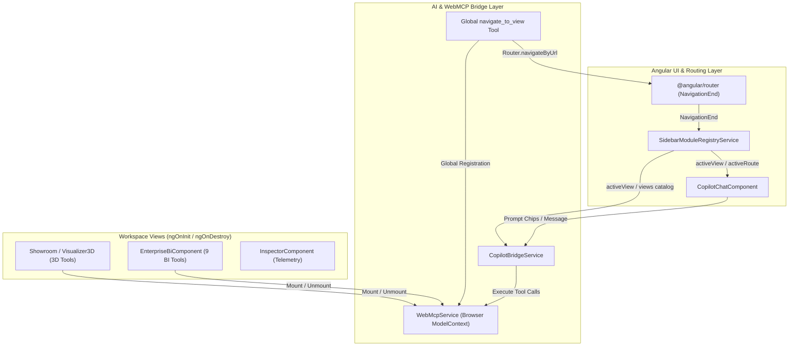

# Design: View-Isolated WebMCP Tools and AI View Navigation

## Technical Approach

Establish strict route-scoped WebMCP tool lifecycle management and contextual AI navigation across Angular 22 workspace views. A global `navigate_to_view` WebMCP tool enables Gemini 3.7 Copilot to programmatically switch routes via Angular `Router`. `SidebarModuleRegistryService` reactively synchronizes `activeRoute` and `activeView` by listening to `Router.events` (`NavigationEnd`). `CopilotBridgeService` dynamically generates a contextual `system` prompt embedding the active view, active tools, available view catalog, and cross-view delegation rules. `CopilotChatComponent` computes reactive prompt suggestion chips tailored to the active workspace.



---

## Architecture Decisions

| Decision | Choice | Alternatives Considered | Rationale |
|---|---|---|---|
| **AI Navigation Mechanism** | Global WebMCP tool (`navigate_to_view`) invoking `Router.navigateByUrl` | Hardcoded client prompt rules; Manual user navigation only | Allows autonomous multi-turn reasoning where AI detects missing tools and transitions view context dynamically. |
| **Route Synchronization** | `NavigationEnd` observable subscription in `SidebarModuleRegistryService` via `takeUntilDestroyed` | Manual route polling; `RouterOutlet` activate events | Guarantees central single-source-of-truth for `activeRoute` and `activeView` signals across header, sidebar, copilot, and telemetry. |
| **System Prompt Composition** | Dynamic `system` message prepended on every autonomous chat turn in `CopilotBridgeService` | Static hardcoded system prompt; Client-side function descriptions only | Provides live context of current view and full catalog of other views so the LLM knows which view contains which tools. |
| **Tool Lifecycle Boundary** | Explicit view component `ngOnInit` / `ngOnDestroy` registration & unregistration | Global static registration of all tools; Lazy micro-frontends | Prevents tool namespace pollution, reduces LLM hallucination risk, and ensures only relevant tools are exposed to OpenAI function schemas. |
| **Prompt Chip Reactivity** | Angular `computed()` signal deriving chips from `SidebarModuleRegistryService.activeView()` | Static chip list; Separate per-view chip components | Automatically updates quick action chips in real-time when the active view changes without duplicating UI drawer code. |

---

## Data Flow & Sequence Diagram

```mermaid
sequenceDiagram
    autonumber
    actor User
    participant Chat as CopilotChatComponent
    participant Bridge as CopilotBridgeService
    participant LLM as Gemini 3.7 Flash High
    participant WebMCP as WebMcpService
    participant Nav as navigate_to_view Tool
    participant Router as Angular Router
    participant Registry as SidebarModuleRegistryService
    participant BI as EnterpriseBiComponent

    Note over User,BI: User is on /3d-showroom; requests Enterprise BI analysis
    User->>Chat: "Show me Q3 revenue metrics and inventory alerts"
    Chat->>Bridge: sendMessage(prompt)
    Bridge->>Registry: Read activeView (/3d-showroom) & views catalog
    Bridge->>WebMCP: Read active tools (3D tools + navigate_to_view)
    Bridge->>LLM: Chat Completion (messages + dynamic system prompt + tools)
    LLM-->>Bridge: tool_call: navigate_to_view(targetView: "enterprise-bi", reason: "Access BI metrics")
    Bridge->>WebMCP: executeTool("navigate_to_view", { targetView: "enterprise-bi" })
    WebMCP->>Nav: handler(params)
    Nav->>Router: navigateByUrl("/enterprise-bi")
    Router-->>Registry: NavigationEnd event (/enterprise-bi)
    Registry->>Registry: Update activeRoute & activeView signals
    Note over Showroom,BI: Showroom unmounts (unregisters 3D tools) -> BI mounts (registers 9 BI tools)
    Nav-->>Bridge: { success: true, targetView: "enterprise-bi", toolsAvailable: [...] }
    Bridge->>Chat: Render Tool Pill (✓ navigate_to_view: 24ms)
    Bridge->>Bridge: runAutonomousTurn(Turn 2 with updated BI tools)
    Bridge->>LLM: Chat Completion (Tool Result + new BI tools schema)
    LLM-->>Bridge: tool_call: query_enterprise_metrics(...) & calculate_kpi_summary(...)
    Bridge->>WebMCP: executeTool("query_enterprise_metrics") -> BI Service
    Bridge->>Chat: Render Assistant Answer with KPI Summary
```

---

## File Changes

| File | Action | Description |
|---|---|---|
| `src/app/services/ai-navigation.service.ts` | Create | Implements and registers global `navigate_to_view` WebMCP tool with validation and error recovery. |
| `src/app/services/sidebar-module-registry.service.ts` | Modify | Subscribes to `Router.events` (`NavigationEnd`) with `takeUntilDestroyed`, exposes `activeRoute` and `activeView` signals. |
| `src/app/services/copilot-bridge.service.ts` | Modify | Generates dynamic contextual `system` prompt with active view context, available views catalog table, and navigation directives. |
| `src/app/components/copilot-chat/copilot-chat.component.ts` | Modify | Exposes reactive `promptChips` computed signal based on `SidebarModuleRegistryService.activeView()`. |
| `src/app/components/showroom/showroom.component.ts` | Modify | Enforces route-scoped tool lifecycle mounting/cleanup on `ngOnInit` / `ngOnDestroy`. |
| `src/app/components/visualizer-3d/visualizer-3d.component.ts` | Modify | Cleans up 3D WebMCP tools upon component destroy. |
| `src/lib/three/three-scene-bridge.ts` | Modify | Adds `unregisterAllTools()` to cleanly remove all 12 3D/CAD tools from `WebMcpService`. |
| `src/app/app.config.ts` | Modify | Initializes `AiNavigationService` / global `navigate_to_view` registration provider. |

---

## Interfaces / Contracts

```typescript
// 1. Navigation Tool Return Contract
export interface NavigateToViewResult {
  success: boolean;
  targetView: string;
  route: string;
  previousRoute: string;
  toolsAvailable: string[];
  message: string;
}

// 2. Navigation Tool Input Parameters Schema
export interface NavigateToViewParams {
  targetView: '3d-showroom' | 'enterprise-bi' | 'inspector' | 'judge-guide' | string;
  reason: string;
}

// 3. Dynamic System Prompt Context Model
export interface DynamicSystemPromptContext {
  activeViewId: string;
  activeViewTitle: string;
  activeRoute: string;
  activeTools: string[];
  viewsCatalog: Array<{
    id: string;
    title: string;
    route: string;
    description: string;
    tools: string[];
  }>;
}
```

---

## Testing Strategy

| Layer | Target | Approach |
|---|---|---|
| Unit | `navigate_to_view` Tool | Verify valid navigation calls `Router.navigateByUrl`, returns success; verify invalid targetView returns graceful failure without throwing. |
| Unit | `SidebarModuleRegistryService` | Test `NavigationEnd` emissions update `activeRoute` and `activeView` signals correctly. |
| Unit | `CopilotBridgeService` Dynamic System Prompt | Verify constructed `system` message includes active view metadata, active tools, views table, and cross-view rules. |
| Unit | `CopilotChatComponent` Prompt Chips | Verify `promptChips()` computed signal matches active route (`/3d-showroom` vs `/enterprise-bi` vs `/judge-guide`). |
| Integration | View Tool Lifecycle | Mount Showroom -> BI -> Showroom. Verify inactive tools are unregistered and active tools match expected count. |

---

## Threat Matrix

| Threat Category | Scenario | Applicability | Safe / Expected Behavior | Planned RED Test |
|---|---|---|---|---|
| **Routing / Injection** | AI passes malicious or non-existent `targetView` path (`../../admin` or arbitrary string) | **Applicable** | `navigate_to_view` validates input against `SidebarModuleRegistryService` view IDs/routes; returns `success: false` with valid choices. | `ai-navigation.service.spec.ts > should reject unknown targetView with validation error` |
| **System Prompt Corruption** | Large views catalog / prompt overflow | **Applicable** | Keep catalog concise in compact Markdown table; dynamic prompt builder formats safely without token blowup. | `copilot-bridge.service.spec.ts > should generate bounded system prompt under 1.5KB` |
| **Tool Lifecycle Memory Leak** | Repeated route transitions leave orphaned tools in `WebMcpService` | **Applicable** | `ngOnDestroy` explicitly unregisters view tools; `WebMcpService.getTools()` count stays exact. | `tool-lifecycle.spec.ts > navigating back and forth does not accumulate duplicate tools` |
| **Multimodal Payload Bloat** | `take_screenshot` base64 payload overwhelming LLM context | **Applicable** | Base64 image payload sanitized in tool response message sent back to LLM context while preserved for UI. | `copilot-bridge.service.spec.ts > should sanitize base64 payload for LLM context` |

---

## Migration / Rollout

No data migration required. Backward compatibility is preserved for existing direct route navigation and manual sidebar clicks.

## Open Questions

None. All contracts, lifecycle boundaries, and schemas are aligned with specifications.
